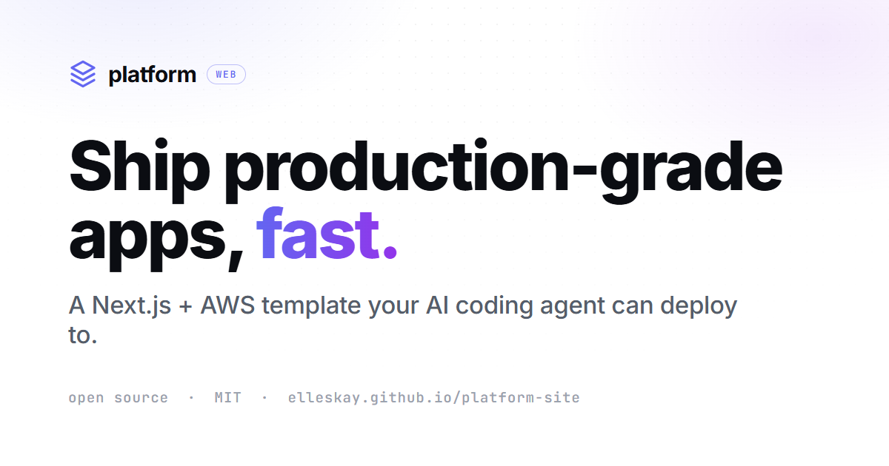
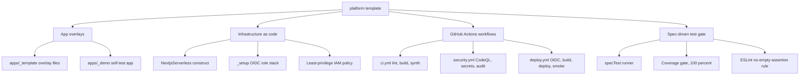
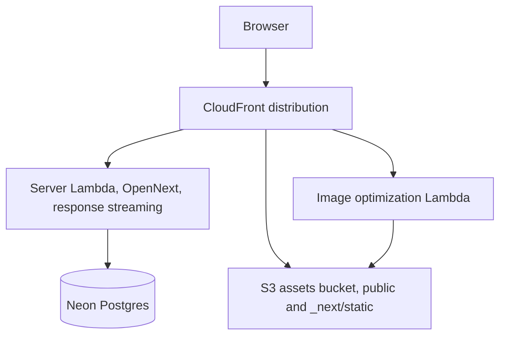

<div align="center">



# Ship production-grade apps, fast.

**Open-source Next.js and AWS template your AI coding agent can deploy to.** Point it at this repo, describe an idea, and it ships a real, live app, with no infrastructure to build.

`Works with` &nbsp; **Claude Code** &nbsp;·&nbsp; **Codex** &nbsp;·&nbsp; **Cursor** &nbsp;·&nbsp; **Windsurf** &nbsp;·&nbsp; **Cline**

[](https://github.com/elleskay/platform/actions/workflows/ci.yml) &nbsp;[](https://github.com/elleskay/platform/actions/workflows/security.yml) &nbsp; &nbsp; &nbsp;[](LICENSE)

### [Live demos and the full story: elleskay.github.io/platform-site](https://elleskay.github.io/platform-site/)

`100% spec coverage` &nbsp;·&nbsp; `0 stored keys` &nbsp;·&nbsp; `9 smoke checks` &nbsp;·&nbsp; `MIT`

</div>

Clone it per app and inherit a working CI/CD pipeline, infrastructure as code via AWS CDK, security scanning, OIDC deploys with zero stored credentials, a spec-driven test gate that blocks merges until every requirement is covered, and a deploy smoke test that catches the production failures this template already learned the hard way.

## See it live

Real apps cloned from this template, on real auth, real data, and a real AWS deploy:

| App | What it is | Live | Source |
|---|---|---|---|
| **CoverLens** | AI insurance policy checker (grounded LangGraph extraction) | [open](https://d33z7oya883ugt.cloudfront.net) | [repo](https://github.com/elleskay/insurance-dashboard) |
| **IRAS Tax Assistant** | Conversational SG tax help (GST, income, corporate, SRS) with multi-model routing | [open](https://d1yl1box414d2i.cloudfront.net) | [repo](https://github.com/elleskay/iras-tax-assistant) |
| **Cancer Navigator** | Roadmap + subsidy coverage for newly diagnosed patients (SG) | [open](https://d1z96o21m62u9i.cloudfront.net) | [repo](https://github.com/elleskay/cancer-navigator) |
| **Armoury** | Equipment checklists for frontline agencies, with an HQ dashboard | [open](https://d6a3alh51t58d.cloudfront.net) | [repo](https://github.com/elleskay/armoury) |

The full showcase, including the mobile apps, is on the [**live site**](https://elleskay.github.io/platform-site/). Building mobile? See the sibling [**mobile-platform**](https://github.com/elleskay/mobile-platform) template (Expo + NestJS on AWS).

## Built to pair with an AI coding agent

Point Claude Code, Codex, Cursor, Windsurf, or Cline at this repo and describe an app: it scaffolds from the template, builds, and ships. The agent conventions live in [CLAUDE.md](CLAUDE.md), including a mandatory spec-first build protocol.

One command wires the whole cloud connection so every push deploys to a live AWS URL with no stored keys:

```bash
npm run setup          # scripts/connect.sh
npm run setup -- --dry-run   # preview without changing anything
```

It ensures the GitHub OIDC provider, deploys a least-privilege deploy role, provisions a database, generates `AUTH_SECRET`, and sets every GitHub Actions secret and variable. The agent guides you through the one interactive choice (the database), the rest is automated.

The repo is its own proof: a real demo app at `apps/_demo/` is built, CDK-synthesised, and run through the spec gate by the same workflows every cloned app inherits, so if the foundation breaks, CI fails here before any app picks it up.

## What you get by cloning

- A `NextjsServerless` CDK construct: one call deploys a Next.js app as Lambda, S3, and CloudFront via OpenNext, auto-routing every `public/` asset to S3 and optionally attaching a custom domain.
- Three GitHub Actions workflows: CI (lint, typecheck, demo build, CDK synth, spec gate), security (CodeQL, secret scan, npm audit), and deploy (OIDC, build, CDK deploy, smoke test).
- A spec-driven test system (`packages/spec-test`): write requirements in YAML first, then code and tests together, and CI refuses to merge below 100 percent requirement coverage.
- A one-command setup (`npm run setup`, `scripts/connect.sh`) that wires the GitHub + AWS connection so deploys carry no long-lived AWS keys.
- A least-privilege IAM policy for the deploy role, so you never reach for `AdministratorAccess`.
- Reference overlay files (auth, security headers, middleware, Sentry, PostHog, email, rate limiting) and a smoke-test script that runs nine checks against the live URL.
- Every production gotcha already solved and documented in `docs/DEPLOY.md`, with each fix kept in place.

## Spec-driven development

Every app on this platform is built from a spec and tested against it. You write `specs/<app>.yml` first: each requirement gets a unique ID, a category, a severity, and given/when/then acceptance criteria. Then implementation and `specTest()` land in the same change. CI runs the gate and refuses to merge unless coverage is 100 percent with no failing tests, no category mismatches, and lint clean. `data` requirements run on Vitest (pure functions); `ui`, `functional`, `security`, and `a11y` run on Playwright. An ESLint rule fails any `specTest()` whose body never calls `expect()`.

A green gate (every requirement covered by a passing test, exit 0):

```
$ node dist/cli.js --spec samples/example.spec.yml --coverage samples/results-full.jsonl
example v1: 100% covered (3/3)
```

A red gate (one requirement has no passing test, exit 1, merge blocked):

```
$ node dist/cli.js --spec samples/example.spec.yml --coverage samples/results.jsonl
example v1: 66.7% covered (2/3)
  uncovered: 1
    - EX-UI-001: Dropdown renders combobox with provided options
```

The gate verifies structure: that every spec ID has a registered test that asserts something. It does not verify the spec is correct, that no feature shipped without a spec entry, or that a feature split across several IDs connects end to end. Those three failure modes are documented honestly in `packages/spec-test/README.md` and `docs/TESTING.md`, along with the journey-level e2e that mitigates the third.

## Logical architecture

What the template hands you, grouped by concern. No app code here, only the foundation.



## Physical architecture (an app deployed on the construct)

One CloudFront distribution fronts a streaming server Lambda, an image Lambda, and an S3 assets bucket; the app talks to Postgres on Neon.



## Quickstart: clone to deployed

```bash
gh repo create my-app --template elleskay/platform --clone --private
cd my-app && npm install
# build your app at apps/web, rename infra/cdk/_template to infra/cdk/my-app
npm run setup          # wires GitHub + AWS (OIDC role, database, secrets)
git push               # deploy.yml builds with OpenNext, deploys, and smoke-tests
```

Full step by step is in `docs/SETUP.md` and `docs/DEPLOY.md`. Serverless idle cost is roughly 0 to 2 USD per month.

## Tech stack

| Layer | Choice |
|---|---|
| Framework | Next.js (App Router), TypeScript strict |
| Runtime | Node 22, AWS Lambda (ARM64) |
| Hosting | CloudFront, S3, Lambda via OpenNext |
| Database | Postgres (Neon), per app, no shared base |
| Auth | Auth.js v5 (NextAuth), JWT sessions |
| IaC | AWS CDK (TypeScript) |
| CI/CD | GitHub Actions, OIDC deploys |
| Security | CodeQL, gitleaks, npm audit, least-privilege IAM |
| Validation | Zod at server-action boundaries |
| Testing | Vitest, Playwright, axe, the spec-test gate |
| Observability | Sentry, PostHog (both no-op without keys) |
| Commits | Conventional Commits, commitlint |

## Local development

```bash
npm ci                          # install the workspace
npm run format                  # prettier across the repo
cd apps/_demo && npm run dev    # run the demo app locally

cd packages/spec-test
npm run build                   # compile the spec-test runner
node dist/cli.js --spec samples/example.spec.yml --coverage samples/results-full.jsonl
```

The root has no app source, so `npm run typecheck` and `npm run lint` at the root are intentional no-ops; each app adds its own.

## Repository structure

```
platform/
├── apps/
│   ├── _template/        Overlay files to drop onto create-next-app
│   └── _demo/            Working Next.js app, CI builds, synths, and spec-gates it
├── infra/
│   ├── cdk/_template/    Full CDK package; lib/constructs/NextjsServerless.ts
│   ├── cdk/_setup/       One-time GitHub OIDC + IAM role stack
│   └── iam/              Least-privilege cdk-deploy-policy.json
├── packages/
│   └── spec-test/        Spec runner, coverage CLI, ESLint rule
├── .github/workflows/    ci.yml, security.yml, deploy.yml
├── scripts/              connect.sh setup, verify-deploy.sh smoke test
├── docs/                 SETUP, DEPLOY, TESTING, SSDLC, variants
└── CLAUDE.md             Conventions and the spec-driven build protocol
```

## Design choices

The template constrains the happy path on purpose. Serverless only (fork if you need always-on containers). Spec before code, every time. No shared infra base, each app is self-contained. Constructs are copied, not imported, so a breaking change never propagates without explicit action. The platform dogfoods itself through `apps/_demo/`. The smaller the surface area, the fewer wrong-by-default ways an app can diverge.

## License

MIT. See [LICENSE](LICENSE).
