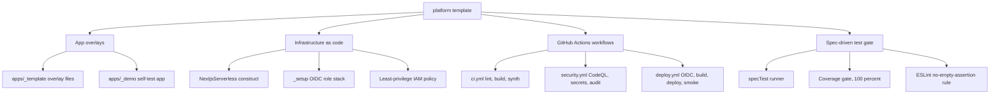
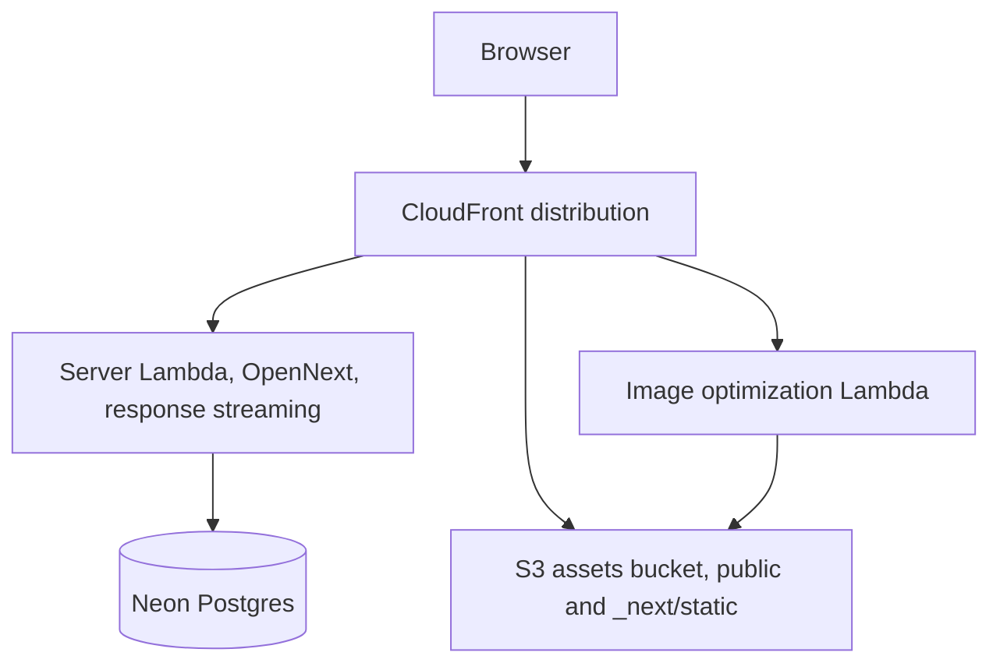
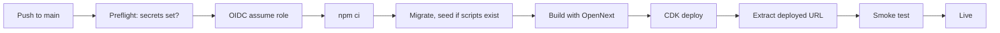
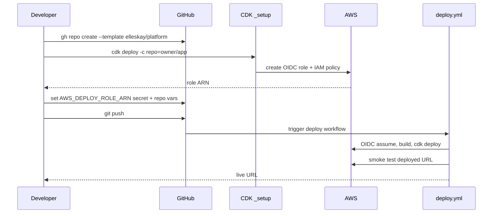
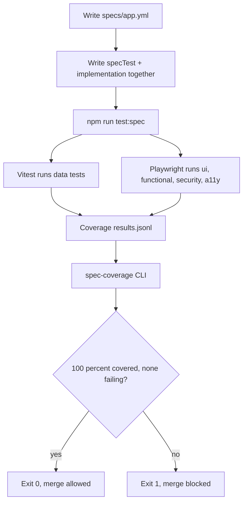
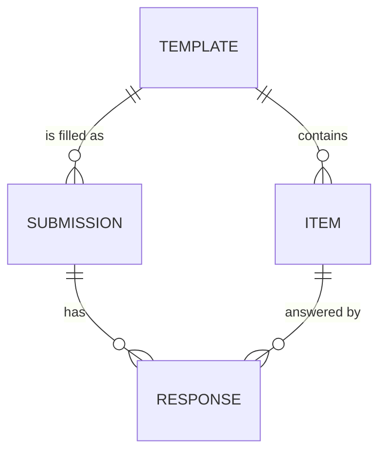

<div align="center">


[](https://github.com/elleskay/platform/actions/workflows/ci.yml) &nbsp;[](https://github.com/elleskay/platform/actions/workflows/security.yml) &nbsp; &nbsp; &nbsp;[](https://elleskay.github.io/platform-site) &nbsp;[](LICENSE)

**A reusable foundation for shipping Next.js apps to AWS serverless, fast and safely.** A TypeScript monorepo template, not a product: clone it per app and inherit a working CI/CD pipeline, infrastructure as code via AWS CDK, security scanning, OIDC-based deploys with zero stored credentials, a spec-driven test gate that blocks merges until every requirement is covered, and a deploy smoke test that catches the production failures this template already learned the hard way.

The owner's apps, [CoverLens](https://github.com/elleskay/insurance-dashboard), [Cancer Navigator](https://github.com/elleskay/cancer-navigator), and [Armoury](https://github.com/elleskay/armoury), are all cloned from it. The repo is its own proof: a real demo app at `apps/_demo/` is built and synthesised by the same workflow every cloned app inherits, so if the foundation breaks, CI fails here before any app picks it up.

</div>

## What you get by cloning

- A NextjsServerless CDK construct: one call deploys a Next.js app as Lambda, S3, and CloudFront via OpenNext, auto-routing every `public/` asset to S3 and optionally attaching a custom domain.
- Three GitHub Actions workflows: CI (lint, typecheck, demo build, CDK synth), security (CodeQL, secret scan, npm audit), and deploy (OIDC, build, CDK deploy, smoke test).
- A spec-driven test system (`packages/spec-test`): write requirements in YAML first, then code and tests together, and CI refuses to merge below 100 percent requirement coverage.
- A one-time setup stack that provisions a GitHub OIDC role so deploys carry no long-lived AWS keys.
- A least-privilege IAM policy for the deploy role, so you never reach for AdministratorAccess.
- Reference overlay files (auth, security headers, middleware, Sentry, PostHog, email, rate limiting) and a smoke-test script that runs nine checks against the live URL.
- Twelve production gotchas already solved and documented in `docs/DEPLOY.md`, with each fix kept in place.

## Demo: the spec gate in action

The template has no live UI to screenshot. Its surface is the command line. Below is the real coverage gate from `packages/spec-test`, run against the bundled sample spec.

A green gate (every requirement covered by a passing test, exit 0):

```
$ node dist/cli.js --spec samples/example.spec.yml --coverage samples/results-full.jsonl

example v1: 100% covered (3/3)
  report: spec-coverage.md
```

A red gate (one requirement has no passing test, exit 1, merge blocked):

```
$ node dist/cli.js --spec samples/example.spec.yml --coverage samples/results.jsonl

example v1: 66.7% covered (2/3)
  uncovered: 1
    - EX-UI-001: Dropdown renders combobox with provided options
  report: spec-coverage.md
```

The deploy smoke test (`scripts/verify-deploy.sh`) probes a live URL after every deploy and exits non-zero on any failure, so a broken deploy never goes green:

```
$ ./scripts/verify-deploy.sh https://d1aeysqic3xk9.cloudfront.net
Detected auth app (root returned 307); checking landing page /login

==> Security headers present
  PASS  Security headers present
==> Stylesheet serves as text/css
  PASS  Stylesheet serves as text/css
==> No Lambda Function URL leaked in auth surface
  PASS  No Lambda Function URL leaked in auth surface

Summary: 9 passed, 0 failed
```

Clone to deployed, end to end:

```
gh repo create my-app --template elleskay/platform --clone --private
cd my-app
# create your app at apps/web, rename infra/cdk/_template to infra/cdk/my-app
cd infra/cdk/_setup && npm install && npx cdk deploy -c repo=<owner>/my-app
# copy the role ARN into the AWS_DEPLOY_ROLE_ARN secret, set repo vars, push
git push   # the deploy workflow builds, deploys, and smoke-tests automatically
```

## Logical architecture

What the template hands you, grouped by concern. No app code here, only the foundation.



## Physical architecture (an app deployed on the construct)

What a single cloned app looks like once `NextjsServerless` deploys it. One CloudFront distribution fronts a streaming server Lambda, an image Lambda, and an S3 assets bucket; the app talks to Postgres on Neon.



## Deployment pipeline

`deploy.yml` runs on push to main (documentation-only changes are skipped). It assumes the AWS role over OIDC, builds with OpenNext, runs CDK deploy, then smoke-tests the deployed URL. A preflight step lets the template repo itself pass without AWS secrets configured.



## Clone-to-running-app flow

The path from template to a deployed app, as a sequence.



## Spec-driven development

Every app on this platform is built from a spec and tested against it. You write `specs/<app>.yml` first: each requirement gets a unique ID, a category, a severity, and given/when/then acceptance criteria. Then implementation and `specTest()` land in the same change. CI runs the gate and refuses to merge unless coverage is 100 percent with no failing tests, no category mismatches, and lint clean. `data` requirements run on Vitest (pure functions); `ui`, `functional`, `security`, and `a11y` run on Playwright. An ESLint rule fails any `specTest()` whose body never calls `expect()`.

A sample requirement, taken verbatim from `packages/spec-test/samples/example.spec.yml`:

```yaml
- id: EX-UI-001
  title: Dropdown renders combobox with provided options
  category: ui
  severity: high
  given: A template item with kind=dropdown and options=[a,b,c]
  when: The submit page renders
  then: A combobox with three options is visible
```

When that requirement has no passing test, the gate prints exactly this and exits 1:

```
example v1: 66.7% covered (2/3)
  uncovered: 1
    - EX-UI-001: Dropdown renders combobox with provided options
```

The gate verifies structure: that every spec ID has a registered test that asserts something. It does not verify the spec is correct, that no feature shipped without a spec entry, or that a feature split across several IDs actually connects end to end. Those three failure modes are documented honestly in `packages/spec-test/README.md` and `docs/TESTING.md`, along with the journey-level e2e that mitigates the third.

## The spec gate flow



## Data model

The template ships no fixed business schema. It supports Postgres (Neon for serverless connection pooling) and wires `DATABASE_URL` through the construct, but each cloned app defines its own tables. The deploy workflow will run `db/migrate.ts` and `db/seed-demo.ts` only if those files exist. The sample spec models a minimal demo domain (a template with items, and submissions of those items), shown here purely to illustrate the kind of entities an app would add; it is not part of the template.



## Tech stack

| Layer | Choice |
|---|---|
| Framework | Next.js (App Router), TypeScript strict |
| Runtime | Node 22, AWS Lambda (ARM64) |
| Hosting | CloudFront, S3, Lambda via OpenNext |
| Database | Postgres (Neon), per app, no shared base |
| Auth | Auth.js v5 (NextAuth), JWT sessions |
| IaC | AWS CDK (TypeScript) |
| CI/CD | GitHub Actions, OIDC deploys |
| Security | CodeQL, gitleaks, npm audit, least-privilege IAM |
| Validation | Zod at server-action boundaries |
| Testing | Vitest, Playwright, axe, the spec-test gate |
| Observability | Sentry, PostHog (both no-op without keys) |
| Commits | Conventional Commits, commitlint |

## Local development

```bash
npm ci                          # install the workspace
npm run format                  # prettier across the repo
cd apps/_demo && npm run dev    # run the demo app locally

cd packages/spec-test
npm run build                   # compile the spec-test runner
node dist/cli.js --spec samples/example.spec.yml --coverage samples/results-full.jsonl
```

The root has no app source, so `npm run typecheck` and `npm run lint` at the root are intentional no-ops; each app adds its own.

## Testing

- `packages/spec-test` is the runner: a Zod-validated YAML spec, a `specTest()` wrapper for Vitest and Playwright, a coverage CLI that gates on 100 percent, and an ESLint rule that blocks assertion-free tests.
- CI self-tests the gate on every code change: it validates the sample spec at full coverage (expects exit 0) and at partial coverage (expects exit 1), so the gate itself cannot silently break.
- The full protocol, category routing, and known failure modes live in `docs/TESTING.md`.

## Deployment

1. Create your app repo from the template, build your app at `apps/web/`, and rename `infra/cdk/_template/` to `infra/cdk/<your-app>/`.
2. Provision the OIDC deploy role: `cd infra/cdk/_setup && npm install && npx cdk deploy -c repo=<owner>/<app>`. Copy the output role ARN.
3. Set the GitHub secret `AWS_DEPLOY_ROLE_ARN` and the repo variables (region, app URL, allowed origins). Attach the IAM policy from `infra/iam/`.
4. Push. `deploy.yml` builds with OpenNext, runs `cdk deploy`, and smoke-tests the live URL.

Full step by step is in `docs/SETUP.md` and `docs/DEPLOY.md`. Serverless idle cost is roughly 0 to 2 USD per month. All twelve production gotchas (Server Actions `allowedOrigins`, the `AUTH_URL` redirect trap, client-side sign-out, build-before-synth ordering, synth-time env baking, and more) are documented in `docs/DEPLOY.md` with the fix kept in place so you do not relearn them.

## Repository structure

```
platform/
├── apps/
│   ├── _template/        Overlay files to drop onto create-next-app
│   └── _demo/            Working Next.js app, CI builds and synths it
├── infra/
│   ├── cdk/_template/    Full CDK package; lib/constructs/NextjsServerless.ts
│   ├── cdk/_setup/       One-time GitHub OIDC + IAM role stack
│   └── iam/              Least-privilege cdk-deploy-policy.json
├── packages/
│   └── spec-test/        Spec runner, coverage CLI, ESLint rule
├── .github/workflows/    ci.yml, security.yml, deploy.yml
├── scripts/              verify-deploy.sh smoke test
├── docs/                 SETUP, DEPLOY, TESTING, SSDLC, variants
└── CLAUDE.md             Conventions and the spec-driven build protocol
```

## Design choices

The template constrains the happy path on purpose. Serverless only (fork if you need always-on containers). Spec before code, every time. No shared infra base, each app is self-contained. Constructs are copied, not imported, so a breaking change never propagates without explicit action. The platform dogfoods itself through `apps/_demo/`. The smaller the surface area, the fewer wrong-by-default ways an app can diverge.

## License

MIT. See `LICENSE`.
