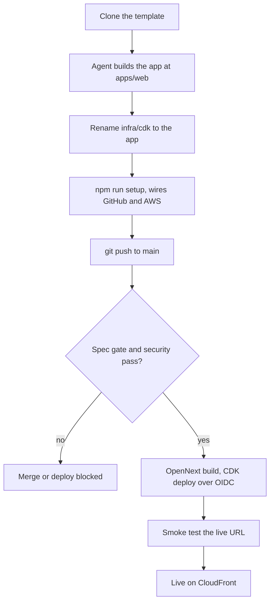
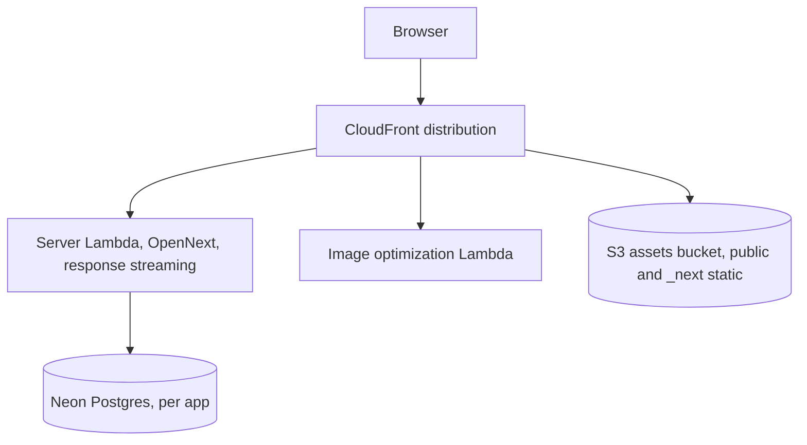
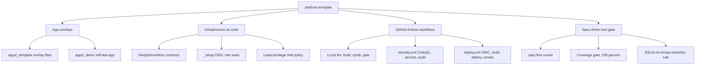

# Platform System Design

> A system design breakdown of platform, an open-source template you point an AI coding agent at. Describe an idea, and the agent scaffolds, builds, and ships a real, live Next.js app to AWS, with the infrastructure, CI/CD, security scanning, keyless deploys, and a spec-driven test gate already wired. The system being designed here is the framework itself.
>
> **Live demos and the full story** at https://elleskay.github.io/platform-site/

---

## Understanding the Problem

Good ideas die in plumbing. An AI coding agent can write application code quickly, but two things stop that from becoming a shipped product: there is no infrastructure for it to deploy onto, and raw agent output cannot be trusted without a way to prove it works. Platform solves both. It is a template an agent clones per app, inheriting a working AWS deploy and a gate that refuses to ship code that is not covered by a passing test.

The defining constraint is trustworthy speed. The agent must be able to go from a brief to a live URL fast, but nothing may ship untested, no long-lived cloud credentials may exist, and a breaking change in the foundation must never silently take down the apps built on it. Everything else follows from that.

### Functional Requirements

- An agent should be able to scaffold an app from the template and ship it to a live AWS URL.
- One command should wire the GitHub-and-AWS connection so every push deploys, with no stored keys.
- A single construct call should deploy a Next.js app as Lambda, S3, and CloudFront, with custom domains and auto-routed assets.
- A spec gate should block any merge below 100 percent requirement coverage, with an ESLint rule rejecting assertion-free tests.
- The pipeline should run security scanning and a post-deploy smoke test against the live URL.
- The template should dogfood itself so the foundation cannot silently break.

Design choices, deliberately out of scope: serverless only (fork for always-on containers), no shared infrastructure base, and constructs are copied into each app rather than imported.

### Non-Functional Requirements

- Deploys should carry zero long-lived AWS credentials.
- Permissions should be least-privilege, never AdministratorAccess.
- A deployed app should cost roughly zero to two dollars a month idle, scale-to-zero.
- Each app should be self-contained, so a foundation change never propagates without an explicit pull.
- The gate should be honest about what it does and does not guarantee.
- Setup should be one idempotent command, safe to re-run, with a dry run.

---

## The Set Up

### Planning the Approach

Platform is a template you clone, not a library you import. That is the central decision: copying the infrastructure into each app means a breaking change lands only when an app explicitly pulls it, instead of rippling out from a shared base. It is agent-first, the conventions live in CLAUDE.md and require a spec before any code. It is serverless only, so the happy path is narrow and hard to diverge from. And it proves itself by building and gating its own demo app in the same workflows every clone inherits.

### Defining the Core Entities

The pieces of the framework, no app code.

- **NextjsServerless construct**, one CDK call that deploys an app as CloudFront, a streaming server Lambda, an image Lambda, and an S3 assets bucket via OpenNext.
- **spec-test package**, the specTest runner, the coverage CLI, and the ESLint no-empty-assertion rule.
- **App overlays** (apps/_template), reference files for auth, security headers, middleware, Sentry, PostHog, email, and rate limiting.
- **Demo app** (apps/_demo), a working app the workflows build, synth, and spec-gate as a self-test.
- **Workflows**, ci, security, and deploy.
- **Setup** (scripts/connect.sh) and the **least-privilege IAM policy** for the deploy role.

### API or System Interface

The framework's surface is a construct, a test gate, and a few commands.

```
The construct (one call deploys the app)
  new NextjsServerless(stack, "Web", { openNextPath, customDomain?, serverTimeoutSeconds? })
    wires CloudFront, a streaming server Lambda, an image Lambda, and an S3 assets bucket

The spec gate
  specTest("APP-DOMAIN-NNN", title, fn, { category })   bind a test to a requirement
  spec-coverage --spec specs/{app}.yml                  the gate, exits nonzero below 100 percent
  (an ESLint rule fails any specTest whose body never calls expect)

Setup and CI
  npm run setup            wire GitHub and AWS (OIDC role, database, secrets), idempotent, --dry-run
  npm run test:spec        build, unit, e2e, coverage gate
```

---

## High-Level Design

We build the design one functional requirement at a time.

### 1) An agent scaffolds an app and ships it

You clone the template, the agent builds the app at apps/web, renames the CDK package, runs one setup command, and pushes. The push runs the gate and, if green, deploys to a live URL and smoke-tests it.


```mermaid
flowchart TD
  Clone[Clone the template] --> Build[Agent builds the app at apps/web]
  Build --> Rename[Rename infra/cdk to the app]
  Rename --> Setup[npm run setup, wires GitHub and AWS]
  Setup --> Push[git push to main]
  Push --> Gate{Spec gate and security pass?}
  Gate -->|no| Block[Merge or deploy blocked]
  Gate -->|yes| Deploy[OpenNext build, CDK deploy over OIDC]
  Deploy --> Smoke[Smoke test the live URL]
  Smoke --> Live[Live on CloudFront]
```

### 2) The cloud connection is wired keyless, in one command

`npm run setup` (scripts/connect.sh) ensures the GitHub OIDC provider, deploys a least-privilege deploy role, provisions a database, generates AUTH_SECRET, and sets every GitHub Actions secret and variable. It is idempotent and has a dry run, and the only interactive choice is the database.

### 3) One construct call deploys the app

The NextjsServerless construct turns an OpenNext build into CloudFront plus a streaming server Lambda, an image Lambda, and an S3 assets bucket, auto-routing every public asset to S3 and optionally attaching a custom domain.


```mermaid
flowchart TD
  U[Browser] --> CF[CloudFront distribution]
  CF --> SRV[Server Lambda, OpenNext, response streaming]
  CF --> IMG[Image optimization Lambda]
  CF --> S3[(S3 assets bucket, public and _next static)]
  SRV --> NEON[(Neon Postgres, per app)]
```

### 4) The spec gate blocks untested merges

Every requirement is written in specs/{app}.yml first with an id, category, severity, and given/when/then. Implementation and the matching specTest land together. The coverage CLI maps each id to a passing test and exits nonzero below 100 percent, and an ESLint rule rejects any test with no assertion.

### 5) The pipeline scans and smoke-tests

The security workflow runs CodeQL, secret scanning, and dependency audit. The deploy workflow finishes with a smoke test of nine checks against the live URL, so a green deploy is one that actually serves.

### The framework, grouped


```mermaid
flowchart TD
  P[platform template] --> APPS[App overlays]
  P --> INFRA[Infrastructure as code]
  P --> CI[GitHub Actions workflows]
  P --> SPEC[Spec-driven test gate]
  APPS --> T[apps/_template overlay files]
  APPS --> D[apps/_demo self-test app]
  INFRA --> C[NextjsServerless construct]
  INFRA --> S[_setup OIDC role stack]
  INFRA --> IAM[Least-privilege IAM policy]
  CI --> CIW[ci.yml lint, build, synth, gate]
  CI --> SECW[security.yml CodeQL, secrets, audit]
  CI --> DEPW[deploy.yml OIDC, build, deploy, smoke]
  SPEC --> RUN[specTest runner]
  SPEC --> GATE[Coverage gate, 100 percent]
  SPEC --> RULE[ESLint no-empty-assertion rule]
```

---

## Potential Deep Dives

### 1) How do we make sure no app ships untested code?

The point of the template is trustworthy agent output, so coverage cannot be optional.

<details>
<summary><strong>Bad solution: a guideline that asks for tests</strong></summary>

Put "please write tests" in the contributing docs. Under deadline pressure it is ignored, and an agent has no reason to follow a guideline it can skip.
</details>

<details>
<summary><strong>Good solution: a line-coverage threshold</strong></summary>

Fail the build below a line-coverage percentage. Better, but line coverage is gameable, you can run every line and assert nothing, and it says nothing about which requirements are actually proven.
</details>

<details>
<summary><strong>Great solution: a requirement-coverage gate plus an assertion check</strong></summary>

Write requirements as data with stable ids, bind each to a specTest by id, and fail the build if any id lacks a passing test. An ESLint rule rejects any test with no expect call, so coverage cannot be faked with an empty test. The gate is honest about its limits, it proves every requirement has a real test, but not that the spec is correct, that every feature has a spec entry, or that a feature split across ids connects end to end, which is why a journey-level e2e is recommended. This is what platform runs.
</details>

### 2) How do we deploy without storing cloud credentials?

Every app pushes to AWS from CI, and a stored key is a standing liability.

<details>
<summary><strong>Bad solution: an AWS access key in GitHub secrets</strong></summary>

Store a long-lived access key for CI to use. If the secret leaks, an attacker has durable access to the account.
</details>

<details>
<summary><strong>Good solution: rotate the keys</strong></summary>

Keep stored keys but rotate them on a schedule. Smaller window, but there is still a long-lived secret to leak between rotations, and rotation is one more thing to operate.
</details>

<details>
<summary><strong>Great solution: OIDC, no stored keys</strong></summary>

GitHub Actions mints a short-lived OIDC token, AWS STS exchanges it for temporary least-privilege credentials, and the role's trust policy pins it to the repo. Nothing long-lived is ever stored, and the deploy role uses a least-privilege policy rather than admin. This is what platform runs.
</details>

### 3) How do we keep a foundation change from breaking every app at once?

Many apps share this foundation, so a bad change could cascade.

<details>
<summary><strong>Bad solution: a shared library every app imports</strong></summary>

Publish the construct as a package every app depends on. One bad release breaks every app on the next install, all at the same time.
</details>

<details>
<summary><strong>Good solution: version the library and pin</strong></summary>

Pin each app to a version and bump deliberately. Safer, but you still operate a versioned package and its upgrade path across every app.
</details>

<details>
<summary><strong>Great solution: copy the construct, and dogfood the template</strong></summary>

Copy the construct into each app rather than importing it, so a change lands only when an app explicitly pulls it, never silently. And build, synth, and spec-gate a demo app in the same workflows every clone inherits, so if the foundation breaks it fails in CI here before any app picks it up. This is what platform runs.
</details>

### 4) How do we catch the production failures that a green deploy hides?

A deploy can succeed while the app is broken, behind auth origin checks, missing env, or a stalled stream.

<details>
<summary><strong>Bad solution: trust that deploy succeeded</strong></summary>

Treat a successful CDK deploy as done. The stack is up, but a misconfigured origin or an empty env var means the live app is broken and nobody knows.
</details>

<details>
<summary><strong>Good solution: hit the health endpoint</strong></summary>

Curl one health route after deploy. Catches a total outage, but not the auth, origin, and asset-routing failures that only show on real routes.
</details>

<details>
<summary><strong>Great solution: a smoke test plus a solved-gotcha catalogue</strong></summary>

Run a smoke test of nine checks against the live URL after every deploy, and keep a documented catalogue of the production failures this template hit the hard way, env baked at synth, Server Actions needing allowedOrigins, the two-pass first deploy, public assets routing, each solved once and kept solved. A green deploy then means the app actually serves. This is what platform runs.
</details>

### 5) How do we make setup one safe command?

Wiring GitHub to AWS by hand is many fiddly, order-sensitive steps.

<details>
<summary><strong>Bad solution: a manual checklist</strong></summary>

Document the OIDC provider, role, database, secret, and variables as steps to do by hand. Error-prone, easy to get out of order, and different every time.
</details>

<details>
<summary><strong>Good solution: a setup script</strong></summary>

Script the steps. Faster, but a re-run that assumes a clean slate can double-create resources or fail halfway.
</details>

<details>
<summary><strong>Great solution: an idempotent setup with a dry run</strong></summary>

One command ensures each piece, the OIDC provider, the least-privilege role, the database, AUTH_SECRET, and every GitHub secret and variable, creating only what is missing, safe to re-run, with a dry-run that changes nothing. This is what platform runs.
</details>

---

## Tech stack

| Layer | Tech |
|---|---|
| Framework | Next.js (App Router), TypeScript strict |
| Runtime | AWS Lambda (ARM64) on the Node 20 runtime, Node 22 build toolchain |
| Hosting | CloudFront, S3, Lambda via OpenNext |
| Database | Postgres on Neon, per app, no shared base |
| Auth | Auth.js v5, JWT sessions |
| IaC | AWS CDK (TypeScript), the copied NextjsServerless construct |
| CI/CD | GitHub Actions, OIDC deploys, no stored keys |
| Security | CodeQL, gitleaks, npm audit, least-privilege IAM |
| Validation | Zod at server-action boundaries |
| Testing | Vitest, Playwright, axe, the spec-test gate at 100 percent |
| Observability | Sentry and PostHog, both no-op without keys |
| Commits | Conventional Commits with commitlint |

## License

MIT.
