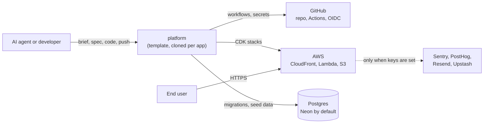
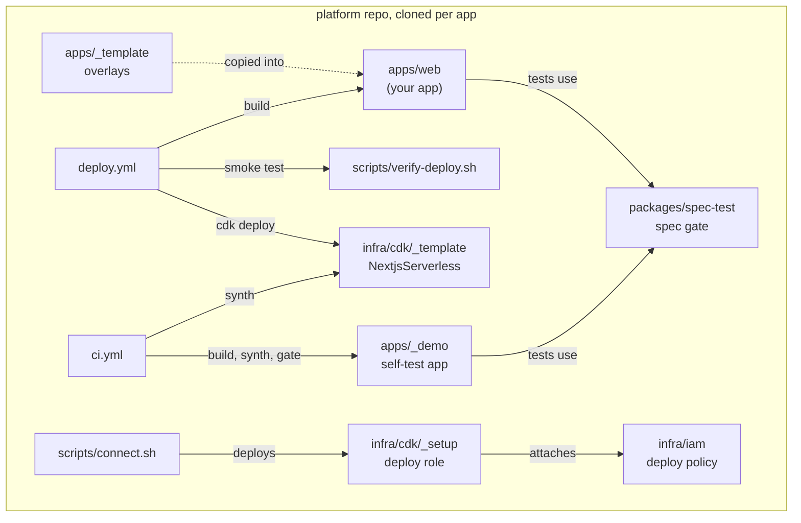
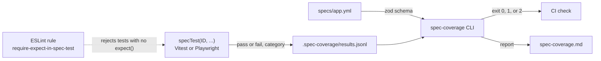
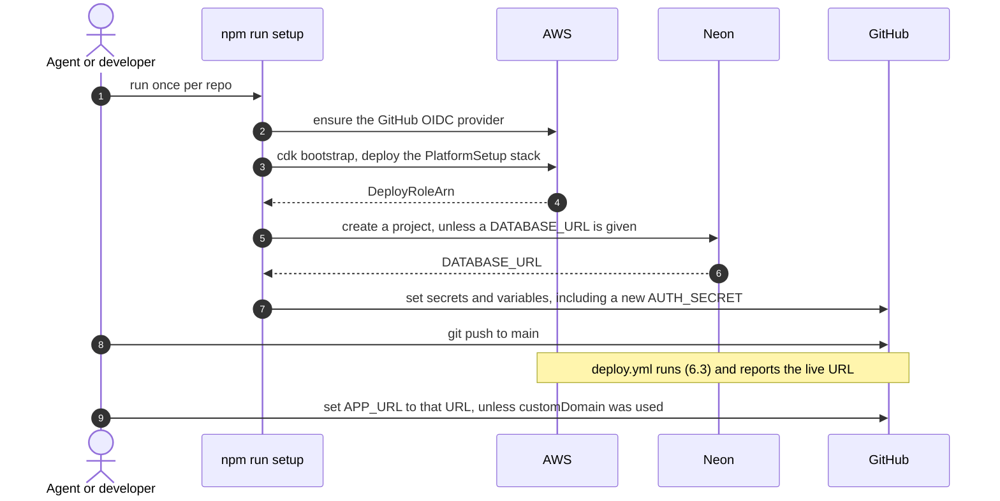
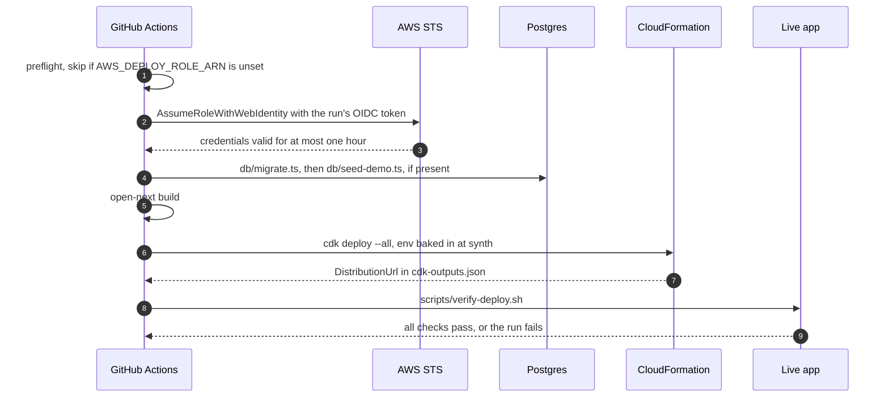
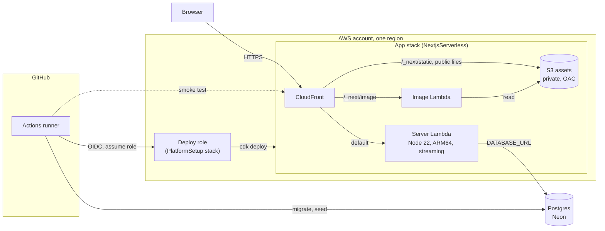

# Platform Architecture

> **platform** is an open-source template you point an AI coding agent at. Describe an app, and the agent scaffolds, builds, and ships a live Next.js app to AWS serverless, with infrastructure as code, CI/CD, security scanning, keyless deploys, and a spec-driven test gate already wired.
>
> This README documents the template's architecture using [arc42](https://arc42.org). The system described is the template itself, not the apps built on it. **Live demos and the full story** at https://elleskay.github.io/platform-site/. To use the template, start with [docs/SETUP.md](docs/SETUP.md).

1. [Introduction and Goals](#1-introduction-and-goals)
2. [Architecture Constraints](#2-architecture-constraints)
3. [Context and Scope](#3-context-and-scope)
4. [Solution Strategy](#4-solution-strategy)
5. [Building Block View](#5-building-block-view)
6. [Runtime View](#6-runtime-view)
7. [Deployment View](#7-deployment-view)
8. [Cross-cutting Concepts](#8-cross-cutting-concepts)
9. [Architecture Decisions](#9-architecture-decisions)
10. [Quality Requirements](#10-quality-requirements)
11. [Risks and Technical Debt](#11-risks-and-technical-debt)
12. [Glossary](#12-glossary)

---

## 1. Introduction and Goals

Good ideas die in plumbing. An AI coding agent writes application code quickly, but two things stop that code from becoming a shipped product: there is no infrastructure for it to deploy onto, and raw agent output cannot be trusted without proof that it works. Platform solves both. An agent clones it per app and inherits a working AWS deploy plus a gate that refuses to ship any requirement without a passing test.

### 1.1 Requirements overview

| ID | Requirement |
|---|---|
| R1 | An agent scaffolds an app from the template and ships it to a live AWS URL. |
| R2 | One command wires GitHub to AWS so every push to `main` deploys, with no stored cloud keys. |
| R3 | One construct call deploys a Next.js app as CloudFront, Lambda, and S3, with an optional custom domain and auto-routed public assets. |
| R4 | A spec gate blocks merges below 100 percent requirement coverage, and a lint rule rejects tests that assert nothing. |
| R5 | The pipeline scans code, secrets, and dependencies, and smoke-tests every deploy against the live URL. |
| R6 | The template dogfoods itself, so a broken foundation fails CI here before any app pulls it. |

Out of scope by design: always-on containers (fork for Fargate), infrastructure shared across apps, a published construct package, and app business logic.

### 1.2 Quality goals

The defining constraint is trustworthy speed: get from brief to live URL fast, but never at the expense of goals 1 to 3.

| Priority | Goal | Meaning |
|---|---|---|
| 1 | Trustworthy output | Nothing merges unless every requirement has a passing test that asserts something. |
| 2 | Security | No long-lived cloud credentials. Deploys use a short-lived, repo-pinned role with a scoped policy, and every PR is scanned. |
| 3 | Change isolation | A foundation change reaches an app only when that app pulls it. |
| 4 | Deployability | One setup command and one push to a live URL, and a green deploy means the app actually serves. |
| 5 | Cost | Scale to zero. An idle app costs roughly 0 to 2 USD a month. |

### 1.3 Stakeholders

| Stakeholder | Expectations |
|---|---|
| AI coding agent (Claude Code, Codex, Cursor, and others) | Explicit conventions in [CLAUDE.md](CLAUDE.md), a spec-first protocol, and a deterministic gate that says when work is done. |
| App developer | Clone, run one command, push, and get a live URL with auth, security headers, and observability pre-wired. |
| Platform maintainer | Foundation changes are proven in CI against a real app before any clone picks them up. |
| Reviewer | Live demos, and an honest account of what the gate does and does not prove. |

## 2. Architecture Constraints

| Constraint | Background |
|---|---|
| Next.js App Router, TypeScript strict, Node 22+ | The single supported app stack. A narrow happy path is easier for an agent to follow and for CI to prove. |
| AWS serverless, deployed with CDK and OpenNext | Lambda (ARM64), S3, and CloudFront. The construct consumes OpenNext's `.open-next/` build output. |
| GitHub and GitHub Actions | Keyless deploys rely on GitHub's OIDC issuer, setup on the `gh` CLI, and merge gating on branch protection. |
| Postgres | Neon by default for serverless connection pooling. Any Postgres URL works. |
| Auth.js v5 with JWT sessions | Edge middleware verifies a session without a database call. |
| Zod at every server-action boundary | Input validation is part of the platform contract. |
| Build on Linux, macOS, or WSL | OpenNext's image function cannot be built on Windows. CI builds on Ubuntu. |
| 60-second request ceiling | CloudFront's origin read timeout without a quota increase. Longer work moves off the request path. |
| Conventional Commits | Enforced by commitlint on PR titles and branch commits. |
| Template scope | Only the cross-cutting platform layer lives here: no business logic, per-product config, secrets, or speculative variants. |

## 3. Context and Scope

### 3.1 Business context


```mermaid
flowchart LR
  Agent["AI agent or developer"] -->|"brief, spec, code, push"| P["platform<br/>(template, cloned per app)"]
  P -->|"workflows, secrets"| GH["GitHub<br/>repo, Actions, OIDC"]
  P -->|"CDK stacks"| AWS["AWS<br/>CloudFront, Lambda, S3"]
  P -->|"migrations, seed data"| DB[("Postgres<br/>Neon by default")]
  User["End user"] -->|"HTTPS"| AWS
  AWS -.->|"only when keys are set"| SaaS["Sentry, PostHog,<br/>Resend, Upstash"]
```

| Neighbor | Provides | Receives |
|---|---|---|
| AI agent or developer | Brief, spec, code, tests, pushes | Conventions, overlays, a pass or fail gate, a live URL |
| GitHub | Repo, Actions runners, OIDC tokens, secrets, branch protection | Workflows, plus the secrets and variables set by `npm run setup` |
| AWS | CDN, compute, storage, IAM, CloudFormation | The app stack and the deploy-role stack |
| Postgres | The app database | Migrations and idempotent seed data on every deploy |
| End user | HTTPS requests | The deployed app |
| Sentry, PostHog, Resend, Upstash | Errors, analytics, email, rate limiting | Calls only when their keys are set. Each helper no-ops otherwise. |

### 3.2 Technical context

| Interface | Channel | Credentials |
|---|---|---|
| Setup to AWS | `aws` CLI and CDK, run once from a workstation | Local AWS credentials able to create an IAM role and an OIDC provider |
| Setup to GitHub and Neon | `gh secret set`, `gh variable set`, `neonctl` | The developer's `gh` and `neonctl` logins |
| Actions to AWS | `sts:AssumeRoleWithWebIdentity` with a GitHub OIDC token, then CDK and CloudFormation | Temporary, at most one hour, trust pinned to the repo |
| Actions to Postgres | `tsx db/migrate.ts`, then `tsx db/seed-demo.ts` | `DATABASE_URL` secret |
| Actions to the live app | `curl` over HTTPS from `scripts/verify-deploy.sh` | None |
| Browser to app | HTTPS to CloudFront: TLS 1.2 or later, HTTP/2 and HTTP/3, HTTP redirected | Auth.js JWT cookie |
| CloudFront to origins | Lambda Function URLs (server responses streamed), S3 through Origin Access Control | S3 is private. Function URLs use auth type `NONE`. |
| Server Lambda to Postgres | Postgres protocol | `DATABASE_URL`, baked into the Lambda env at synth |

## 4. Solution Strategy

| Goal | Approach |
|---|---|
| Trustworthy output | Requirements are data (`specs/<app>.yml`) with stable IDs. `specTest()` binds each test to an ID, `spec-coverage` fails the build below 100 percent, and an ESLint rule rejects assertion-free tests. |
| Security | GitHub OIDC instead of stored keys, a repo-pinned role with one-hour sessions and a scoped policy, and CodeQL, gitleaks, npm audit, and Dependabot. |
| Change isolation | A template, not a library: each app copies the construct and the gate and shares no infrastructure. CI dogfoods the template on `apps/_demo`. |
| Deployability | One setup command, one push, and a smoke test against the live URL. Each production failure met so far is fixed in the construct, overlays, or workflows and catalogued in [docs/DEPLOY.md](docs/DEPLOY.md). |
| Cost | Serverless only: Lambda, S3, and CloudFront scale to zero. |
| Agent fit | Conventions live in [CLAUDE.md](CLAUDE.md): spec before code, tests and code in the same change, never done while the gate is red. |

## 5. Building Block View

### 5.1 Level 1: the template


```mermaid
flowchart LR
  subgraph repo["platform repo, cloned per app"]
    direction LR
    TPL["apps/_template<br/>overlays"]
    DEP["deploy.yml"]
    CI["ci.yml"]
    CONNECT["scripts/connect.sh"]
    WEB["apps/web<br/>(your app)"]
    VERIFY["scripts/verify-deploy.sh"]
    CDK["infra/cdk/_template<br/>NextjsServerless"]
    DEMO["apps/_demo<br/>self-test app"]
    SETUP["infra/cdk/_setup<br/>deploy role"]
    ST["packages/spec-test<br/>spec gate"]
    IAM["infra/iam<br/>deploy policy"]
  end
  TPL -.->|"copied into"| WEB
  DEP -->|"build"| WEB
  DEP -->|"smoke test"| VERIFY
  DEP -->|"cdk deploy"| CDK
  CI -->|"synth"| CDK
  CI -->|"build, synth, gate"| DEMO
  CONNECT -->|"deploys"| SETUP
  WEB -->|"tests use"| ST
  DEMO -->|"tests use"| ST
  SETUP -->|"attaches"| IAM
```

| Building block | Location | Responsibility |
|---|---|---|
| Conventions | `CLAUDE.md`, `docs/` | Agent protocol, setup checklist, deploy runbook and gotcha catalogue, testing guide, SSDLC. |
| App overlays | `apps/_template/` | Files copied into a new app: security headers and Server Actions origins, edge-safe auth and middleware, client sign-out, Sentry, PostHog, toasts, email, rate limiting, UI primitives, test scaffolding, and the app's gate workflow (`test.yml`). |
| Demo app | `apps/_demo/` | A minimal working app that CI builds, synths, and gates as the template's self-test. Stays in every clone. |
| Spec gate | `packages/spec-test/` | Spec schema, `specTest()` for Vitest and Playwright, the `spec-coverage` CLI, and the ESLint rule. See 5.2. |
| CDK package | `infra/cdk/_template/` | The `NextjsServerless` construct, `WebStack`, and CDK boilerplate. Copied per app. See 5.2. |
| Deploy-role stack | `infra/cdk/_setup/` | One-time stack: an IAM role trusted by the repo's GitHub OIDC tokens. |
| Deploy policy | `infra/iam/cdk-deploy-policy.json` | The deploy role's policy, used instead of `AdministratorAccess`. |
| Setup | `scripts/connect.sh` | `npm run setup`: OIDC provider, CDK bootstrap, deploy role, database, `AUTH_SECRET`, and GitHub secrets and variables. |
| Smoke test | `scripts/verify-deploy.sh` | Post-deploy checks against the live URL, adapting to auth and public apps. |
| Workflows | `.github/workflows/` | `ci.yml` (quality and self-test), `security.yml` (scanning), `deploy.yml` (OIDC deploy). |
| Guardrails | `.github/`, root configs | Dependabot, CODEOWNERS, PR template, and shared TypeScript, ESLint, Prettier, and commitlint configs. |

### 5.2 Level 2

#### NextjsServerless

`new NextjsServerless(stack, "Web", props)` turns an OpenNext build into the stack described in [section 7](#7-deployment-view). Its outputs are `<id>DistributionUrl` (read by the deploy workflow), `<id>CloudFrontDomain`, and `<id>LambdaUrlHost` (for `ALLOWED_ORIGINS`).

| Prop | Default | Purpose |
|---|---|---|
| `appPath` | required | App directory containing `.open-next/`. |
| `environment` | required | Lambda env, baked at synth: `DATABASE_URL`, `AUTH_SECRET`, `AUTH_URL`, and any app secret. |
| `customDomain` | none | Domain, ACM certificate in `us-east-1`, and optional hosted zone. Makes the first deploy a single pass. |
| `serverTimeoutSeconds` | 30 | Raises the Lambda timeout and the CloudFront read timeout together, up to 60. |
| `defaultCachePolicy` | caching disabled | An origin-respecting policy for static or SSG-heavy apps. |
| `logicalIdOverrides` | none | Keeps CloudFormation logical IDs when adopting the construct on an existing stack. |

`serverMemoryMb` (1024), `priceClass` (`PRICE_CLASS_200`), and `logRetention` (14 days) tune the rest.

#### spec-test


```mermaid
flowchart LR
  SPEC["specs/app.yml"] -->|"zod schema"| CLI["spec-coverage CLI"]
  TEST["specTest(ID, ...)<br/>Vitest or Playwright"] -->|"pass or fail, category"| JSONL[".spec-coverage/results.jsonl"]
  JSONL --> CLI
  RULE["ESLint rule<br/>require-expect-in-spec-test"] -.->|"rejects tests with no expect()"| TEST
  CLI -->|"exit 0, 1, or 2"| CHECK["CI check"]
  CLI -->|"report"| MD["spec-coverage.md"]
```

| Module | Responsibility |
|---|---|
| `schema.ts`, `parser.ts` | Parse the spec YAML and validate it with zod. Unknown fields, duplicate IDs, and dangling `depends_on` references fail. |
| `spec-id.ts` | The single source of truth for the ID grammar, shared by the schema, both runners, and the lint rule. |
| `vitest.ts`, `playwright.ts` | `specTest(id, title, fn, { category })` prefixes the test title with `[ID]` and records the result and category. |
| `coverage.ts` | Appends results to `.spec-coverage/results.jsonl`. |
| `report.ts`, `cli.ts` | Compare spec IDs with results and write `spec-coverage.md`. Exit 0 when every requirement has a passing test in its layer, 1 on any uncovered, failing, or mismatched requirement, and 2 on an invalid spec. |
| `eslint-rule.ts` | `require-expect-in-spec-test`: a `specTest()` body without `expect()` fails lint. |

## 6. Runtime View

### 6.1 Clone to live URL

```bash
gh repo create my-app --template elleskay/platform --clone --private
cd my-app && npm install
# Write the spec, then build the app at apps/web (docs/SETUP.md, step 3)
cp apps/_template/.github/workflows/test.yml .github/workflows/
cp -r infra/cdk/_template infra/cdk/my-app   # then rename the stack id in bin/app.ts
npm run setup -- --cdk-dir infra/cdk/my-app  # add --dry-run to preview
git push -u origin main
```

Keep `apps/_demo` and `infra/cdk/_template`, because CI's self-test uses both. The gate workflow goes in the root `.github/workflows/`, the only place GitHub runs workflows from.


```mermaid
sequenceDiagram
  autonumber
  actor Dev as Agent or developer
  participant S as npm run setup
  participant AWS
  participant Neon
  participant GH as GitHub
  Dev->>S: run once per repo
  S->>AWS: ensure the GitHub OIDC provider
  S->>AWS: cdk bootstrap, deploy the PlatformSetup stack
  AWS-->>S: DeployRoleArn
  S->>Neon: create a project, unless a DATABASE_URL is given
  Neon-->>S: DATABASE_URL
  S->>GH: set secrets and variables, including a new AUTH_SECRET
  Dev->>GH: git push to main
  Note over AWS,GH: deploy.yml runs (6.3) and reports the live URL
  Dev->>GH: set APP_URL to that URL, unless customDomain was used
```

Without `customDomain`, the first deploy cannot know its own URL: set `APP_URL` afterward (setup prints the command) and tighten `ALLOWED_ORIGINS` to the real hosts. With `customDomain`, pass `--app-url` to setup and the first deploy is final.

### 6.2 Pull request to merge

1. `ci.yml` lints the workflows (actionlint) and the PR title and commits (commitlint), then typechecks and lints. Unless the change is docs-only, it also builds `apps/_demo` with OpenNext, runs `cdk synth` of the construct against that build, and self-tests the gate: the lint rule must flag a bad sample, the CLI must exit 1 on partial coverage, and the demo must pass its own spec.
2. `security.yml` runs CodeQL, gitleaks, and an advisory npm audit of all three lockfiles.
3. The app's `test.yml` starts a Postgres 17 service, migrates and seeds it, then typechecks, lints, builds, runs the unit and e2e specs, and applies the coverage gate. The report is uploaded and kept as a single PR comment.
4. Branch protection requires the `Spec coverage gate` check, so a red gate blocks the merge.

### 6.3 Deploy on push to main


```mermaid
sequenceDiagram
  autonumber
  participant GA as GitHub Actions
  participant STS as AWS STS
  participant DB as Postgres
  participant CFN as CloudFormation
  participant App as Live app
  GA->>GA: preflight, skip if AWS_DEPLOY_ROLE_ARN is unset
  GA->>STS: AssumeRoleWithWebIdentity with the run's OIDC token
  STS-->>GA: credentials valid for at most one hour
  GA->>DB: db/migrate.ts, then db/seed-demo.ts, if present
  GA->>GA: open-next build
  GA->>CFN: cdk deploy --all, env baked in at synth
  CFN-->>GA: DistributionUrl in cdk-outputs.json
  GA->>App: scripts/verify-deploy.sh
  App-->>GA: all checks pass, or the run fails
```

- Docs-only pushes skip the deploy. `workflow_dispatch` deploys on demand to `production` or `staging`.
- Deploys to one environment queue rather than cancel each other.
- The smoke test classifies the app by its root response. An auth app (root redirects to `/login`) gets nine checks: health (skipped if absent), the redirect, `/login`, five security headers, a stylesheet link, CSS served as `text/css`, NextAuth providers, a CSRF token, and no leaked Lambda Function URL. A public app (root returns 200) gets five: health, the root page, headers, stylesheet link, and CSS type.

### 6.4 Serving a request

CloudFront routes by path. `/_next/static/*` and public files come from S3 and cache at the edge. `/_next/image*` goes to the image Lambda, which reads originals from S3, and is cached too. Everything else streams from the server Lambda, uncached: middleware sends anonymous users to `/login`, and the app queries Postgres.

## 7. Deployment View

### 7.1 Infrastructure


```mermaid
flowchart LR
  Browser["Browser"] -->|"HTTPS"| CF
  subgraph gh["GitHub"]
    RUN["Actions runner"]
  end
  subgraph aws["AWS account, one region"]
    ROLE["Deploy role<br/>(PlatformSetup stack)"]
    subgraph stack["App stack (NextjsServerless)"]
      CF["CloudFront"]
      SRV["Server Lambda<br/>Node 22, ARM64, streaming"]
      IMG["Image Lambda"]
      S3[("S3 assets<br/>private, OAC")]
    end
  end
  DB[("Postgres<br/>Neon")]
  CF -->|"default"| SRV
  CF -->|"/_next/image"| IMG
  CF -->|"/_next/static, public files"| S3
  IMG -->|"read"| S3
  SRV -->|"DATABASE_URL"| DB
  RUN -->|"OIDC, assume role"| ROLE
  ROLE -->|"cdk deploy"| stack
  RUN -->|"migrate, seed"| DB
  RUN -.->|"smoke test"| CF
```

| Node | Configuration |
|---|---|
| CloudFront | Default behavior to the server Lambda: all methods, uncached, managed security-headers policy. `/_next/static/*` and each top-level `public/` entry go to S3, and `/_next/image*` to the image Lambda. HTTP redirected to HTTPS, TLS 1.2 or later, HTTP/2 and HTTP/3. |
| Server Lambda | Node 22, ARM64, 1024 MB, 30 s timeout, Function URL with response streaming. |
| Image Lambda | Node 22, ARM64, 1024 MB, 15 s timeout, read access to the assets bucket. |
| Assets bucket | Private, S3-managed encryption, SSL enforced, reached only through Origin Access Control. Filled by a 1536 MB uploader so first deploys do not stall. |
| Extras | Log groups with 14-day retention, and Route 53 A and AAAA aliases when a hosted zone is given. |

| Artifact | Built or run by | Lands on |
|---|---|---|
| `.open-next/server-functions/default` | `open-next build` in the deploy job | Server Lambda |
| `.open-next/image-optimization-function` | `open-next build` | Image Lambda |
| `.open-next/assets` | `open-next build` | Assets bucket |
| `db/migrate.ts`, `db/seed-demo.ts` | The deploy job, before `cdk deploy` | Postgres |
| `infra/cdk/<app>` | `cdk deploy --all` | One CloudFormation stack per app, named by the stack id in `bin/app.ts` |
| `infra/cdk/_setup` | `npm run setup`, once per repo | The `PlatformSetup-<owner>-<repo>` stack holding the deploy role |
| OIDC provider, CDK bootstrap | `npm run setup`, once per account (bootstrap per region) | Shared by every app in the account |

### 7.2 Environments and cost

- One environment, `production`, by default. `staging` is a second GitHub environment with its own secrets and variables, deployed through `workflow_dispatch`. For real isolation, give each environment its own AWS account.
- A low-traffic app typically idles under 1 USD a month, mostly CloudWatch Logs. The rejected Fargate path (ECS, ALB, RDS, NAT) idles around 95 USD a month.

## 8. Cross-cutting Concepts

### 8.1 Spec-driven development

- Requirements live in `specs/<app>.yml`, each with an ID (`<APP>-<DOMAIN>-<NNN>`, for example `ARM-SUBMIT-004`), a category, a severity, and given/when/then. The spec comes first, and code and its `specTest()` land in the same change.
- Category picks the test layer: `data` runs in Vitest, while `ui`, `functional`, `security`, and `a11y` run in Playwright.
- Every user-facing feature also gets one journey-level e2e that walks the whole path, because a feature split across IDs can be fully covered while one link is broken.
- Non-deterministic services (LLMs, third-party APIs) are stubbed in e2e with `page.route`, so the gate stays deterministic and offline.

### 8.2 Keyless deploys

- Each deploy run trades a GitHub OIDC token for credentials that expire within an hour. The role trusts only audience `sts.amazonaws.com` and subjects in this repo (`repo:<owner>/<name>:*`).
- Session names carry the run ID (`gh-deploy-<run_id>`), so CloudTrail ties every call to a workflow run.
- The policy covers CloudFormation, Lambda, S3, CloudFront, IAM roles for the stack, logs, SSM, and ECR reads, with `iam:PassRole` limited to Lambda and CloudFront.
- Workflows default to read-only tokens and check out without persisted credentials. Only the deploy workflow can request an OIDC token.

### 8.3 Configuration and secrets

- Secrets (`AWS_DEPLOY_ROLE_ARN`, `DATABASE_URL`, `AUTH_SECRET`) live in GitHub Actions secrets. Settings (`AWS_REGION`, `APP_URL`, `ALLOWED_ORIGINS`, and optionally `APP_DIR` and `CDK_DIR`) are variables. Setup sets all of them, `APP_URL` only when given `--app-url`. Nothing secret is committed.
- CDK bakes the Lambda env at synth, so values must be in the shell that runs `cdk deploy`. An app-specific secret is therefore wired twice: in the stack's `environment` (`web-stack.ts`) and in the env of the deploy workflow's CDK step.
- `ALLOWED_ORIGINS` is read at build time. `AUTH_URL` (from `APP_URL`) must be the canonical public URL, or NextAuth redirects to the Lambda URL.

### 8.4 Authentication and web security

- Auth.js v5 with JWT sessions. The edge-safe `auth.config.ts` (no database imports) lets `middleware.ts` send anonymous users to `/login`, and providers live in the Node-only `auth.ts`.
- Sign-out calls `signOut` from `next-auth/react`, because a server-action sign-out does not clear cookies behind OpenNext.
- Server Actions accept only `ALLOWED_ORIGINS` (the CloudFront and Lambda URL hosts), which doubles as CSRF protection.
- `next.config.ts` sends HSTS with preload, `nosniff`, `X-Frame-Options: DENY`, a strict referrer policy, and a restrictive permissions policy. CloudFront's managed security-headers policy backs them up.
- Zod validates every server action's input, and Upstash rate limiting guards auth and sensitive routes.

### 8.5 Optional services

Sentry, PostHog, Resend, and Upstash are pre-wired and no-op until their keys are set, and the rate limiter fails open. Local dev, CI, and smoke tests need no third-party accounts, and the demo's spec (`DEMO-RATELIMIT-001`) proves the fail-open path.

### 8.6 Data changes

- Deploys run `db/migrate.ts` before the new code goes live. A deploy that fails afterward leaves the old code on the new schema, so migrations must stay backward compatible.
- `db/seed.ts` is destructive and runs only in dev and CI. `db/seed-demo.ts` is idempotent (natural-key lookups, timestamps anchored to a fixed `DEMO_ANCHOR`) and runs on every deploy.
- Deploys never run destructive operations. Rollback is `git revert` and push.

### 8.7 Caching

The default behavior never caches, the safe choice for personalized SSR. Static assets and optimized images cache at the edge. Static-heavy apps opt in to origin `Cache-Control` through `defaultCachePolicy`.

### 8.8 Observability

Sentry for errors (10 percent trace sampling), PostHog for analytics and feature flags, CloudWatch Logs with 14-day retention, and structured JSON logs without PII or secrets.

### 8.9 Supply chain

Dependabot updates npm (root and both CDK packages) and GitHub Actions weekly. Root updates group minor and patch bumps and leave majors as individual PRs, so a regression stays bisectable. The actionlint image is pinned by version because Dependabot does not update `docker://` references.

## 9. Architecture Decisions

### ADR-1: Copy the platform into each app, share nothing

- **Context.** Many apps sit on this foundation, and one bad change must not break them all at once.
- **Decision.** Each app is a clone. The construct and the gate are copied, not imported, and each app owns its AWS resources and database.
- **Rejected.** A shared package, where one bad release breaks every app on its next install. A versioned, pinned package, which is safer but still a package and an upgrade path to operate across every app.
- **Consequences.** A change lands only when an app pulls it. Fixes do not propagate on their own either ([risk 9](#11-risks-and-technical-debt)).

### ADR-2: Deploy over GitHub OIDC with no stored keys

- **Context.** Every app deploys to AWS from CI, and a stored key is a standing liability.
- **Decision.** GitHub Actions trades a per-run OIDC token for short-lived credentials on a repo-pinned role with a scoped policy.
- **Rejected.** An access key in GitHub secrets, where a leak grants durable access. Rotated keys, which shrink the window but still leave a secret to leak and a rotation to run.
- **Consequences.** Nothing long-lived exists to leak. Setup needs broad AWS credentials once, locally, and deploys depend on GitHub as the identity provider.

### ADR-3: Gate on requirement coverage, not line coverage

- **Context.** Agent output is only trustworthy if tests cannot be skipped or faked.
- **Decision.** Requirements are data with stable IDs, each bound to a `specTest()`. The build fails below 100 percent, and a lint rule rejects tests without `expect()`.
- **Rejected.** A guideline asking for tests, which is ignored under pressure. A line-coverage threshold, which runs every line while asserting nothing and says nothing about which requirements are proven.
- **Consequences.** Every requirement provably has a real, passing test. The gate proves structure only ([risk 1](#11-risks-and-technical-debt)).

### ADR-4: Serverless only

- **Context.** Most apps on the platform idle most of the time, and an agent needs one path, not several.
- **Decision.** Lambda, S3, and CloudFront through OpenNext, on AWS itself rather than Vercel.
- **Rejected.** Fargate (ECS, ALB, RDS, NAT) at around 95 USD a month idle. Vercel, which is simpler but beside the point: the platform exists to show AWS-native deploys with CDK, IAM, and OIDC.
- **Consequences.** Scale to zero and near-zero idle cost. No WebSockets or long-running jobs, a 60-second request ceiling, and cold starts. Container workloads fork the template.

### ADR-5: The template proves itself

- **Context.** A template that is never deployed rots silently.
- **Decision.** CI builds `apps/_demo` with OpenNext, synths the construct against it, and runs the demo through the spec gate, in the same workflows every clone inherits.
- **Rejected.** Letting downstream apps find the breakage, late and one app at a time.
- **Consequences.** A broken foundation fails CI here first. `apps/_demo` and `infra/cdk/_template` stay in every clone.

### ADR-6: A green deploy means the app serves

- **Context.** CloudFormation can succeed while the app is broken by a wrong origin, an empty env var, or unrouted assets.
- **Decision.** Smoke-test every deploy against the live URL, and fix each production failure once, in the construct, overlays, or workflow, catalogued in [docs/DEPLOY.md](docs/DEPLOY.md).
- **Rejected.** Trusting the CDK result, where the stack is up and the app is not. A single health check, which catches outages but not auth, origin, or asset-routing failures.
- **Consequences.** A broken deploy turns the run red. That version is already live by then, so recovery is a revert ([risk 6](#11-risks-and-technical-debt)).

### ADR-7: One setup command with a dry run

- **Context.** Wiring GitHub to AWS by hand is many order-sensitive steps.
- **Decision.** `npm run setup` checks each AWS piece before creating it, sets every GitHub secret and variable, and offers `--dry-run`.
- **Rejected.** A manual checklist, which is error-prone and different every time. A naive script, which double-creates resources or fails halfway on a re-run.
- **Consequences.** An agent can run setup for the user, who only picks the database and logs in. Re-runs are safe for AWS, not yet for the database ([risk 5](#11-risks-and-technical-debt)).

## 10. Quality Requirements

### 10.1 Quality tree

| Quality goal | Refinement | Scenarios |
|---|---|---|
| Trustworthy output | Coverage cannot be skipped or faked | Q1, Q2, Q3 |
| Security | No long-lived credentials, and the role is bound to the repo | Q4, Q5 |
| Change isolation | Foundation breaks surface in the template, not in apps | Q6 |
| Deployability | A green deploy means a serving app, and setup is repeatable | Q7, Q8 |
| Cost | An idle app costs almost nothing | Q9 |

### 10.2 Quality scenarios

| ID | Scenario | Expected response |
|---|---|---|
| Q1 | A PR adds a requirement to the spec without a test. | `spec-coverage` exits 1, the `Spec coverage gate` check fails, and branch protection blocks the merge. |
| Q2 | A `specTest()` body never calls `expect()`. | Lint fails before any test runs. |
| Q3 | A `ui` requirement is covered only by a Vitest test. | The gate reports a category mismatch and exits 1. |
| Q4 | The repo's GitHub secrets leak. | They hold no AWS keys. The role ARN is useless outside this repo's workflows, and issued credentials expire within an hour. |
| Q5 | A workflow in another repo tries to assume the deploy role. | STS refuses, because the trust policy pins the token subject to this repo. |
| Q6 | A change breaks the construct. | `ci.yml` fails on the demo build, `cdk synth`, or the dogfooded gate before any app pulls the change. |
| Q7 | CloudFormation succeeds but the app is broken: headers missing, CSS unserved, or the Lambda URL leaking. | The smoke test fails and the deploy run goes red. |
| Q8 | `npm run setup` runs a second time. | The OIDC provider, bootstrap, and deploy role are reused or updated in place, not duplicated. |
| Q9 | An app gets no traffic for a month. | It costs roughly 0 to 2 USD. |

## 11. Risks and Technical Debt

Ordered by priority.

| # | Risk or debt | Mitigation |
|---|---|---|
| 1 | **The gate proves structure, not correctness.** A wrong spec, behavior with no spec entry, and a feature whose covered IDs do not connect all pass. | Review spec changes, write one journey-level e2e per user-facing feature, and click through the live app after deploy. |
| 2 | **A direct push to `main` deploys without the gate.** `deploy.yml` cannot wait on a check from another workflow. | Branch protection that requires PRs and the `Spec coverage gate` check (a manual setting). |
| 3 | **The deploy role trusts any ref in the repo** (`repo:<owner>/<name>:*`), so anyone with write access can assume it from a branch workflow. | Pin the subject to the deploy environments, for example `repo:<owner>/<name>:environment:production`. |
| 4 | **`cdk bootstrap` defaults its CloudFormation execution role to `AdministratorAccess`**, and deploys run through the bootstrap roles, so that policy, not `cdk-deploy-policy.json`, bounds what a deploy can create. | Bootstrap with `--cloudformation-execution-policies` set to a scoped policy. |
| 5 | **Setup re-runs are not idempotent for data.** Without `--database-url` or `--skip-db`, a re-run provisions another Neon project and repoints `DATABASE_URL` to it, and every run regenerates `AUTH_SECRET`, signing everyone out at the next deploy. | Re-run with `--database-url` or `--skip-db`. |
| 6 | **No automatic rollback.** A failed smoke test turns the run red, but the broken version is already live. | `git revert` and push. |
| 7 | **Function URLs are public** (auth type `NONE`), so the server origin is reachable without CloudFront. CloudFront OAC for Lambda needs a payload hash on every POST, which browsers do not send for Server Actions. | Keep auth, headers, and rate limits in the app, never only at the edge. |
| 8 | **The deploy policy is scoped by service, not resource** (`s3:*`, `lambda:*`, `cloudfront:*` on `*`). | Fine at portfolio scale. Narrow the resource ARNs for production. |
| 9 | **Copies drift.** Construct and gate fixes do not reach existing apps. | Diff against the template when upgrading. |
| 10 | **The first deploy takes two passes** without a custom domain, since `AUTH_URL` is unknown until CloudFront exists. | Pass `customDomain`, or set `APP_URL` after the first deploy. |
| 11 | **The uncached default plus low Lambda concurrency** on new accounts can return `Rate Exceeded`. | `prefetch={false}` on links, a `defaultCachePolicy`, or a concurrency quota increase. |
| 12 | **`npm audit` is advisory**, so a high-severity advisory does not fail CI. | Dependabot security updates. |
| 13 | **The deploy path encodes 17 production gotchas.** Undoing a fix brings its failure back. | Read [docs/DEPLOY.md](docs/DEPLOY.md) before changing the deploy path. |

## 12. Glossary

| Term | Meaning |
|---|---|
| Spec | `specs/<app>.yml`: the app's requirements, each with an ID, category, severity, and given/when/then. |
| Requirement ID | `<APP>-<DOMAIN>-<NNN>`, for example `ARM-SUBMIT-004`. |
| `specTest()` | A Vitest or Playwright test bound to one requirement ID. |
| Spec gate | The `spec-coverage` CLI. It fails the build unless every requirement has a passing test in the right layer. |
| Category mismatch | A requirement covered only by a test in the wrong layer, such as a `ui` requirement tested only in Vitest. |
| Journey test | An e2e that walks one user-facing feature end to end, across its requirement IDs. |
| Decomposed-journey gap | A feature whose IDs are all covered while the path between them is broken. |
| Overlay | A reference file in `apps/_template/` that is copied into a new app. |
| Dogfooding | CI running the template's own demo app through the pipeline every clone inherits. |
| OpenNext | The adapter that turns a Next.js build into Lambda and S3 bundles under `.open-next/`. |
| `NextjsServerless` | The CDK construct that deploys an OpenNext build as CloudFront, Lambda, and S3. |
| OIDC deploy | CI trading a short-lived GitHub token for temporary AWS credentials instead of storing keys. |
| Synth | CDK's synthesis of CloudFormation, the moment the Lambda env is fixed. |
| Two-pass deploy | Deploying once to learn the CloudFront URL, then again with `AUTH_URL` set to it. |
| Smoke test | `scripts/verify-deploy.sh`, run against the live URL after every deploy. |

## License

MIT.
